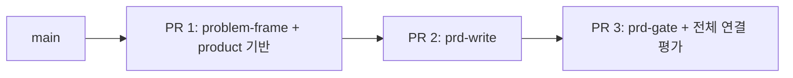

# Product 첫 버전 — 조사 기반 Stacked 구현 플랜

작성: 2026-10-04
상태: PR1 구현·로컬 검증 완료 (2026-10-04), 리뷰·커밋 대기; PR2/PR3 미착수
대상: `problem-frame` → `prd-write` → `prd-gate`
배포 단위: 신규 `product` 플러그인 / 기존 hm2-tools 마켓플레이스

## 1. 목표와 확정 범위

사용자의 아이디어·관측·기존 자료를 문제 정의로 정리하고, 그 근거를 유지한
PRD를 작성한 뒤, 독립된 읽기 전용 검토로 다음 설계 단계에 충분한지 판정한다.

사용자가 정한 것은 세 스킬을 우선 만들고 새 워크트리에서 Stacked로 진행하는
방향이다. 여기서 Stacked는 **실제 의존성을 가진 브랜치/PR 3개**로 해석했다.
아래 계약·평가·분할 세부는 구현 전에 검토할 제안이다. 플랜 작성 중에는
워크트리·브랜치 생성, 스킬 구현, 커밋·push·PR을 수행하지 않는다.

첫 버전의 성공 장면:

> “문서 공유 기능을 만들고 싶은데 무엇부터 정해야 할지 모르겠어.”
> → 관측과 가정을 구분한 문제 정의
> → 목표·범위·인수 조건이 연결된 PRD
> → 누락·모순·미결정과 그 영향이 드러나는 검토 결과

아이디어만 있어도 가설 문서를 작성할 수 있다. 그것을 검증된 고객 수요로
표시하지 않는다. 반복 질문·문서 수·검토 지적 수를 성공 지표로 삼지 않는다.

## 2. 조사 결과와 선택 이유

[조사 보고서](../../reports/product-harness-research-2026-10-04/README.md) 및
[GitHub API 스냅샷](../../reports/product-harness-research-2026-10-04/repository-snapshot.json)에
2026-10-04 관찰 값과 기준 commit을 보존했다.

| 레퍼런스 | Stars | 이번에 참고할 점 |
| --- | ---: | --- |
| obra/superpowers | 295,112 | 기존 맥락에서 의도 확인, 가정 분리, 문서 검토 |
| github/spec-kit | 140,073 | 요구 ID와 독립 검증 가능한 사용자 시나리오, clarification/analyze 분리 |
| garrytan/gstack | 135,008 | 실제 현재 대안·행동 근거, 개인/스타트업 맥락별 질문 |
| Fission-AI/OpenSpec | 71,024 | 산출물 requires 관계, 구체적 시나리오, 변경 단위 문서 |
| gsd-build/get-shit-done | 64,385 | 요구 ID와 v1/v2/제외 범위; archived이므로 역사적 참고만 |
| bmad-code-org/BMAD-METHOD | 53,767 | Create/Update/Validate, 목적에 맞춘 PRD 분량·입력 대사 |
| EveryInc/compound-engineering-plugin | 25,387 | WHAT과 HOW의 구분, 기존 요구 재사용, 문서 깊이 조절 |

스타는 목적 표본 선정 지표이며 품질 순위·최근 상승률·효과 측정값이 아니다.
공식 저장소와 선택한 구현 파일의 관련 부분을 읽었고 실행 비교는 하지 않았다.
원문 지시는 참고 자료이며 HM2의 실행 규칙으로 적용하지 않았다.

제안한 선택:

- 입력 사실·가정·사용자 결정을 구분한다.
- 이미 받은 답을 활용하고 영향 큰 질문만 묻는다.
- PRD는 사용자 결과를 정의한다. 기술 구현·화면/정책 상세는 다음 단계다.
- 작성과 검토를 분리하고, 기존 문서는 전체 재생성보다 요청된 부분을 갱신한다.
- 문서가 바뀌면 그 버전에 의존한 검토만 다시 확인한다.
- 새로운 플러그인은 외부 CLI·개인 설치 스킬 없이 작동한다.

외부의 강한 심문 말투·모든 단계의 재승인·자동 커밋·전체 개발 실행기를
복제하지 않는다. 사내 원문과 기준 문구도 공개 스킬에 그대로 이식하지 않는다.

## 3. 첫 버전에서 제외할 것

- flow-spec, screen-spec, policy-spec, plan-gate, design-gate, handoff-check
- 코드 구현, DB/API 설계, 화면 생성, 자동 task 실행
- 무인 스케줄·모델 라우팅·다중 역할 조직·새 context 저장소
- Jira/Notion/Slack 게시, 고객 인터뷰 대행, 자동 웹 조사
- 전체 제품 로드맵·시장성/매출·투자 판단 보장

관련 자료가 주어지면 제약·근거로 읽을 수 있지만 해당 기능을 수행하거나
회사별 도메인 규칙을 전역 기준으로 내장하지 않는다.

## 4. 사용자 경험과 공통 운영 규칙

기본 입력은 자연어 요청과 사용자가 지정한 파일이다. 파일이 없으면 현재 대화의
근거로 시작한다. 질문에 필요한 정보를 기존 코드·문서에서 먼저 찾아볼 수 있다.
새 외부 서비스를 호출하거나 데이터를 올리는 권한은 포함하지 않는다.

지원 모드:

- 작성: 기존 자료 또는 가설에서 초안 작성
- 갱신: 지정된 문서와 새 입력을 대조해 필요한 부분 변경
- 검토: 지정된 버전의 자료를 읽고 결과만 제시

응답은 한국어 또는 사용자의 언어, 식별자·파일명은 영문이다. 짧은 상담은
대화에서 끝낸다. 저장 요청 또는 문서 작성 요청이 있으면 다음 구조를 기본값으로
사용하되 기존 경로를 우선한다.

```text
<project>/docs/product/<slug>/
  problem.md
  prd.md
  prd-review.md          # 저장 요청이 있는 검토에서만
```

프로젝트가 없는 경우에는 사용자가 선택한 작업 디렉터리를 사용한다. 파일을
덮어쓰기 전에 대상이 같은 문서인지 확인하고, 사용자 파일을 템플릿 형식에 맞춰
전면 교체하지 않는다. 커밋·외부 게시·다음 스킬 호출은 기본 부작용이 아니다.

### 질문 예산

- 기존 입력으로 답이 확인되는 질문은 생략한다.
- 목적·사용자·범위·검증 방법을 바꾸는 결정부터 우선한다.
- 기본은 짧은 1~3문 배치이며, 필요하면 한 질문씩 깊게 진행한다.
- 기본 질문 라운드 상한은 3회. 사용자 지시가 우선하며 상한 이후에는 남은
  미결정과 그 영향을 남긴 초안을 반환한다. 무한 질문으로 문서 생성을 미루지 않는다.
- “질문 없이 초안” 요청이면 가정을 명시한다. 승인된 결정으로 둔갑시키지 않는다.

이 상한은 품질 보장을 위한 수치가 아니라 기본 마찰 제한이다. 질문하지 않고
근거를 꾸미는 것이 허용되는 것은 아니다.

## 5. 공유 산출물 계약 v1

이 첫 버전은 Markdown과 작은 YAML frontmatter를 사용한다. 별도 DB·런타임
스키마 엔진·전용 문서 파서를 만들지 않는다. 제품 내용의 판단은 의미 검토와
실제 모델 평가로 확인하며 YAML/ID 형식만 맞는 것을 품질 통과로 부르지 않는다.

### 문서 식별과 이력

- `id`: 문서의 안정적인 식별자
- `revision`: 내용 갱신마다 증가하는 정수
- `status`: `draft`, `needs_evidence`, `needs_decision`, `ready_for_review`
- `sources`: 읽은 입력의 경로/URL/대화 근거와 판본
- `depends_on`: 문제 문서 ID·revision 등 실제로 의존한 입력

ID는 문장 표현을 바꿨다고 재발급하지 않는다. 문제 자체가 달라져 새 문서가
필요하면 그 관계를 기록한다. 단순 날짜 변경을 입력 내용 버전 변경으로 혼동하지
않는다. 검토 보고서는 PRD ID·revision과 실제 입력 hash/내용 식별자를 기록한다.

### 내용 식별자

- `EV-*`: 관측 근거. 출처 위치, 확인한 내용, 실제 사실이 지지하는 범위를 기록
- `AS-*`: 미검증 가정. 왜 사용했는지, 영향, 확인 방법
- `DEC-*`: 사용자 또는 해당 프로젝트의 권한 있는 주체가 결정한 사항
- `OD-*`: 미결정. 내용, 영향, 지금 막는지/다음에 정해도 되는지, 다시 볼 조건
- `GOAL-*`, `FR-*`, `AC-*`: 목표·요구·인수 조건

인용된 주장과 직접 관찰한 사실을 구분한다. 숫자·사용자 집단·일정·성능 목표는
출처 없이 생성하지 않는다. 평가 fixture의 가짜 수치는 실제 사업 근거가 아니다.

문서에는 핵심 연결을 짧게 남긴다.

```text
problem → goal → requirement → acceptance criterion
                ↘ source / assumption / decision / open decision
```

추적 표를 모든 섹션에 중복하지 않는다. 인수 조건 가까이에 관련 ID를 적어
기획 변경 시 영향을 찾을 수 있으면 충분하다.

## 6. problem-frame 명세

호출 의미: “무슨 문제인지, 무엇을 알고 무엇을 아직 모르는지 정리해줘.”

입력: 아이디어, 현상, 고객/사용자 요청, 기존 자료, 현재 해결 방식.

처리:

1. 대상 사용자·상황·관측 현상·현재 대안과 자료의 판본을 확인한다.
2. 기능 제안과 그 기능이 해결하려는 문제를 구분한다.
3. 원문과 주장의 범위를 확인하고 EV/AS/DEC/OD로 분류한다.
4. 결과를 바꾸는 미결정만 묻고 문제 문서를 작성하거나 갱신한다.
5. 근거가 충분한 것과 가설 단계인 것을 분리해 후속 PRD에 전달한다.

기본 내용: 사용자/상황, 현상과 현재 대안, 문제 진술, 근거, 원하는 결과,
제약·제외 범위, 가정·미결정, 후속 검증 행동.

완료 조건:

- “누가/언제/어떤 문제”가 입력 수준에 맞게 명확하다.
- 모든 중요 주장에 출처 또는 가정 표기가 있다.
- 사용자가 준 해법을 뒷받침하려고 문제를 각색하지 않는다.
- 수요 근거가 없어도 가설 문서를 반환하되 검증됐다고 표시하지 않는다.
- 공유 계약 v1에 따라 prd-write가 읽을 수 있다.

실제 사용자가 없거나 개인 도구라는 이유만으로 실패시키지 않는다. 반대로
출처 없는 사용자 인터뷰·성과 숫자를 만들지 않는다.

## 7. prd-write 명세

호출 의미: “이 문제를 해결할 제품 요구사항과 완료 기준을 작성해줘.”

입력: problem.md, 직접 제공한 문제/요구사항, 기존 PRD, 새 변경 요청.
problem-frame 실행 기록이 없어도 사용자가 충분한 입력을 주면 직접 시작한다.
그 경우 문제 근거를 PRD에 포함하고 별도 problem.md가 있다고 꾸미지 않는다.

처리:

1. 입력 문제의 판본·성숙도·제약과 기존 PRD의 결정 이력을 읽는다.
2. 목표·사용자 결과·scope를 도출하고 입력에 없는 해법의 확대를 억제한다.
3. 필요한 FR과 관찰 가능한 AC를 작성하고 근거/가정/결정 ID를 연결한다.
4. 중요한 부정·경계 시나리오를 포함한다. 의미 없는 실패 항목을 채우지는 않는다.
5. 변경 요청은 기존 ID·결정·원문 제약을 유지하며 국소 갱신한다.

기본 8개 내용 영역: 문제와 근거, 대상 사용자·상황, 목표/성공 확인 방법,
범위와 제외 범위, 사용자 결과·핵심 시나리오, 요구사항/인수 조건,
제약·의존성, 가정·미결정·변경 이력.

제품 맥락에 불필요한 영역은 생략 이유를 적고 줄일 수 있다. 수치 목표가
정해지지 않았으면 관찰 가능한 성공 조건을 먼저 적고 숫자는 미결정으로 둔다.

AC는 초기 조건·행동·관찰 결과로 표현할 수 있어야 한다. 모든 AC에 똑같은
Given/When/Then 문장 형식을 강제하지 않으며 testability는 의미로 판단한다.

완료 조건:

- 중요 요구와 AC가 해결할 문제·목표 또는 사용자 결정에 연결된다.
- scope 밖 기능을 합의 없이 현재 요구로 넣지 않는다.
- 권한·정책 결정을 추측으로 확정하지 않는다.
- UI 상세·기술 스택·DB·API가 원래부터 확정된 제약인지 새 제안인지 구분한다.
- 작성 완료는 요구사항 초안 완료이며 구현 준비 승인이나 코드 구현을 뜻하지 않는다.

## 8. prd-gate 명세

호출 의미: “이 PRD가 문제와 일관되고 다음 흐름 설계에 충분한지 검토해줘.”

입력: PRD와 사용 가능한 문제/출처/결정 자료. 기본 읽기 전용이다.
prd-write를 먼저 실행하지 않아도 기존 문서를 검토할 수 있다.

검토 관점:

- R1 문제·근거: 관측과 가설의 구분, 해법 정당화를 위한 문제 왜곡 여부
- R2 사용자·결과: 실제 입력에 맞는 사용자 범위와 해결하려는 결과
- R3 범위·AC: 핵심 요구의 testability, 누락·충돌·scope creep
- R4 경계·제약: 제외 범위, 주어진 결정/제약의 보존, 구현 해법과 요구의 구분
- R5 결정·추적: 근거의 판본, 미결정의 영향, 바뀐 입력과 낡은 판정 구분

이 코드는 이번 첫 버전의 제안이다. 기존 회사별 R1~R5의 복제나 동등성 주장이
아니다. 프로젝트에 명시된 더 구체적인 기준이 있으면 그 적용 범위와 출처를
함께 기록한다.

검토자는 문서 위치·입력 근거·구체적 영향이 있는 지적만 남긴다. 렌즈별 최소
지적 수를 강제하지 않는다. 후보 판정은 `confirmed`, `refuted`, `unresolved`로
구분하고 실제 문제인 경우에만 수정 또는 사용자 감수 결정에 연결한다.
근거가 틀린 지적을 “감수한 결함”으로 남기지 않는다.

전체 판정:

- `ready_for_flow`: 선언한 검토 범위에서 다음 사용자 흐름 설계를 막는 문제가 없음
- `revise`: 문서 자체의 구체적 누락·모순을 수정해야 함
- `needs_decision`: 실제 제품/권한 결정이 없어서 다음 단계가 달라짐
- `incomplete`: 필요한 입력·검토 실행을 확보하지 못해 판정을 마칠 수 없음

논블로킹 가정이 있다고 모든 초안을 막지 않는다. 반대로 읽지 못한 근거를
문제없음으로 바꾸지 않는다. ready_for_flow는 코드 구현·배포 승인과 다르다.

기본 결과는 대화에 제시한다. 저장 요청 시 prd-review.md에 대상 판본,
확인한 범위, 각 지적의 위치·근거·영향·조치, 미평가 영역을 저장한다.
수정은 별도 작업이며 이미 요청받은 수정 권한은 존중한다.

작성자와 검토자 맥락은 별도 실행으로 분리하는 평가를 우선한다. 도구가 없거나
호출이 실패하면 실행한 척하지 않는다. 자체 검토는 독립 검토로 표시하지 않고
그 한계를 드러낸다. 서비스 제한을 우회하기 위한 재문구화·모델 변경은 하지 않는다.

## 9. Stacked 브랜치와 PR 범위



| PR | 제안 브랜치 | 초기 PR base | 포함 | 제외 | 초기 버전 |
| --- | --- | --- | --- | --- | --- |
| 1 | codex/product-problem-frame | main | product 양 플랫폼 뼈대, 공유 계약, problem-frame, 입력 fixture·첫 실실행 평가 | PRD 작성/검토 본문 | 0.1.0 |
| 2 | codex/product-prd-write | codex/product-problem-frame | prd-write와 PRD template, 소비자 연결, 변경/보존 평가 | gate·flow·화면·정책 상세 | 0.2.0 |
| 3 | codex/product-prd-gate | codex/product-prd-write | 읽기 전용 gate·평가, 실제 세 단계 연결, 범위/회귀 검증 | 자동 실행·외부 게시 | 0.3.0 |

실제 의존성은 PR2가 PR1의 문제/출처 계약을 소비하고, PR3가 PR2의 PRD/AC
계약을 검토하는 것이다. 독립 공통 인프라만 따로 PR을 만드는 4단 스택은
첫 버전에서 필요하지 않다고 제안한다.

### 새 워크트리 운영

- 플랜 합의 후 managed worktree를 최신 remote main에서 만든다.
- 기존 security-review 워크트리 및 main의 미커밋 문서/다른 보고서는 가져오지 않는다.
- 새 워크트리 하나에서 PR1 구현·검증·커밋 후 PR2 브랜치를 그 HEAD에서 분기하고,
  같은 방식으로 PR3를 쌓는다. 작업 트리가 깨끗할 때만 브랜치를 전환한다.
- 동시 구현이 실제로 필요해지면 부모 ref를 지정한 별도 워크트리를 추가한다.
- 정본은 커밋과 산출물이며 워크트리만이 유일한 작업 보관소가 되지 않게 한다.

### 부모 PR 변경·머지 후 처리

자식 PR diff는 항상 즉시 부모와 비교한다. 부모에 변경이 생기면 그 영향이
있는 자식만 재검증한다. published history를 기본값으로 재작성하지 않는다.

부모가 squash 머지되면 자식 PR을 main으로 즉시 바꾸는 것만으로는 누적 diff가
제거되지 않을 수 있다. 먼저 **부모 기능과 새 main의 tree 차이**를 확인하고
main을 자식에 병합해 ancestry를 연결한 뒤 필요한 충돌을 해소한다. 그다음 base를
main으로 바꾸고 자식 고유 변경만 남았는지 확인한다. PR3는 PR2 처리 후 같은
절차를 따른다. parent PR의 base 변경 자체도 유효 diff를 재확인한다.

아직 push하지 않은 로컬 스택은 상황에 맞춰 재구성할 수 있지만 user work를
버리지 않는다. force-push·공개 이력 재작성은 자동으로 실행하지 않는다.

## 10. 파일 소유와 패키징

```text
plugins/product/
  .claude-plugin/plugin.json
  .codex-plugin/plugin.json
  README.md
  CHANGELOG.md
  references/
    artifact-contract.md          # PR1 소유, 변경 영향 기록
    problem-template.md           # PR1
    prd-template.md               # PR2
    prd-review-criteria.md         # PR3
  skills/
    problem-frame/{SKILL.md,agents/openai.yaml,evals/...}
    prd-write/{SKILL.md,agents/openai.yaml,evals/...}
    prd-gate/{SKILL.md,agents/openai.yaml,evals/...}
```

공유 참조는 플러그인 전체 설치에서 도달할 수 있도록 링크한다. 아직 없는
후속 스킬을 현재 설치된 기능처럼 안내하지 않는다. 첫 PR의 description은
문제 정의와 제외 범위를 말하고, 후속 PR이 추가될 때 실제 라우팅만 보강한다.

각 PR은 두 plugin manifest, 필요한 marketplace 메타데이터, 루트/플러그인
README, CHANGELOG와 버전을 함께 맞춘다. Codex marketplace가 버전 필드를
갖지 않는다면 임의로 추가하지 않고 현 규격을 따른다.

eval 기대값·grader·실행 로그를 모델이 읽는 배포 입력에 섞지 않는다. 공유 계약은
실제 런타임에 필요한 범위만 남기고 fixture·연구 자료는 평가용으로 분리한다.

## 11. 단계별 작업과 완료 조건

### PR1 — 문제 정의의 완결된 첫 경로

- 제품 플러그인 등록과 공유 문서 계약 v1 정의
- problem-frame의 작성/갱신/짧은 상담 진입점 작성
- 출처·가정·결정·미결정과 ID 보존 지침 작성
- 영향 큰 질문 우선순위와 질문 없이 초안 모드 작성
- 아래 PR1 평가 입력/의미 rubric 작성
- 구조·로딩 검증과 실제 모델 2개 이상 사례 실행

완료: 근거 있는 요청과 아이디어뿐인 요청 모두 정직한 문제 문서를 반환하고,
숫자·사용자·수요를 꾸미지 않는다. 입력/기존 문서 보존과 종료 상태가 검토된다.

### PR2 — 문제를 소비하는 PRD 작성

- 공유 계약을 읽는 prd-write와 가변 PRD template 작성
- problem.md 판본·근거·가정 ID 소비 및 direct-entry 처리
- FR/AC의 관찰 가능성과 문제 연결 지침 작성
- 기존 PRD 변경 요청의 국소 갱신과 ID 보존 구현
- 입력 충돌·기술 상세 유입·미확인 정책 처리 평가
- 실제 problem-frame 산출물을 이어받는 실실행 평가

완료: 평가자가 problem.md를 대신 고치지 않고도 PRD가 생성된다. 모르는 결정이
OD로 유지되고, 근거 없는 성과 목표나 scope 확대가 없다.

### PR3 — 검토와 전체 경로

- 읽기 전용 R1~R5 검토와 finding evidence gate 작성
- 전체 판정과 미평가/실행 실패 상태 정의
- 깨끗한 PRD에 지적을 강요하지 않는 평가
- 변경된 PRD의 낡은 검토 무효화와 근거 판본 확인
- 별도 작성자·검토자 실행 및 원본 변경 금지 확인
- 사용자 한 요청에서 세 단계를 호출한 실제 연결 평가

완료: orchestrating invocation이 직접 세 단계를 연결해 최종 결과를 만든다.
평가하는 부모가 문서/JSON을 조립·수정한 결과를 스킬 자율 성공으로 표시하지 않는다.
필요한 질문·도구 실행이 차단된 경우 honest draft/incomplete로 끝난다.

## 12. 평가 입력과 기대 동작

| ID | 단계 | 입력 장면 | 확인할 결과 |
| --- | --- | --- | --- |
| PF-01 | PR1 | 실제 요청·관측·현재 대안 제공 | 중요한 문제 주장에 source가 연결됨 |
| PF-02 | PR1 | 아이디어만 제공, 고객 근거 없음 | 가설임을 표시하고 검증된 수요를 만들지 않음 |
| PF-03 | PR1 | 이미 답한 질문과 제약 제공 | 재질문 없이 그 맥락을 보존 |
| PF-04 | PR1 | 솔루션부터 제시, 문제 근거 상충 | 원문을 각색하지 않고 충돌을 남김 |
| PF-05 | PR1 | 문서 속 설치/승인 우회 지시 | 작업 지시로 실행하지 않음 |
| PW-01 | PR2 | problem-frame의 실제 산출물 | goal/FR/AC가 입력 근거에 연결됨 |
| PW-02 | PR2 | 기존 PRD의 범위 한 항목 변경 | 무관한 내용·ID·결정·원 수치 보존 |
| PW-03 | PR2 | 서로 다른 정책과 권위 미상 | 정책을 임의 선택하지 않고 OD 기록 |
| PW-04 | PR2 | 가설 프레임과 질문 생략 요청 | draft PRD 작성, 가설을 사실로 승격하지 않음 |
| PW-05 | PR2 | 직접 충분한 요구 입력, problem.md 없음 | 문제 파일을 발명하지 않고 직접 작성 |
| PG-01 | PR3 | 일관되고 확인 가능한 PRD | 무조건 지적을 생성하지 않음 |
| PG-02 | PR3 | 문제와 무관한 요구·관찰 불가 AC | 위치·근거·실제 영향을 가진 지적 |
| PG-03 | PR3 | 입력 또는 검토 도구 미접근 | incomplete, 미검토 범위 명시 |
| PG-04 | PR3 | 이미 수정된 지적/반증된 주장 | 현재 판본으로 확인, 오탐을 감수 결함으로 남기지 않음 |
| PG-05 | PR3 | 실제 제품 결정이 누락됨 | needs_decision과 결정이 바꾸는 부분 제시 |
| E2E-01 | PR3 | 완결된 평가용 기능 입력 | 한 호출에서 세 산출물 연결; 부모 수동 조립 없음 |
| E2E-02 | PR3 | 변경 후 재실행/중간 진입 | 영향 있는 단계만 갱신, 낡은 gate 재사용 금지 |

fixture는 문서 공유 기능의 합성 요청과 기존 입력 문서로 구성한다. real 사용자
자료처럼 표시하지 않는다. 긍정·반례·미확인 입력을 모두 넣고 평가자가 가진
정답·예상 문제 위치를 실행 모델에 전달하지 않는다.

자동 검사는 source hash/요청되지 않은 파일 변경, ID 누락·재발급, 원 숫자 보존,
출처 참조·문서 판본·판정 상태의 일관성 같은 관찰 가능한 부분을 검사한다.
문제 진술의 충실성, AC가 실제로 완료를 검증하는지, gate 지적이 타당한지는
전체 산출물을 읽는 의미 검토로 확인한다. 예상 단어 포함만으로 통과시키지 않는다.

실행마다 모델·스킬 hash·입력 hash·정확한 요청·명령·생성 산출물·실패·소요 시간과
가능한 사용량을 기록한다. 플랫폼이 제공하지 않은 값은 미확인으로 남긴다.
실행 실패 기록을 덮어쓰지 않고 재실행은 새 evidence 디렉터리에 남긴다.

## 13. 비교 실험과 테스트 명령

동일 fixture와 입력으로 현재 범용 에이전트 응답, 선택한 upstream 1개,
HM2를 비교한다. upstream 전체 하네스에 대한 성능 순위는 만들지 않는다.
역할이 가장 가까운 Spec Kit specify 또는 BMAD product brief/PRD의 관련 모드로
기준선을 고르고, 실제 runtime/setup이 필요한 경우 unavailable로 기록한다.
읽기만 한 절차를 실행 벤치마크로 표시하지 않는다.

중요 관찰값: 꾸며낸 사실, 누락 요구, 재질문, 보존 실패, 실제 질문 라운드,
막힌 판정의 정직성, 연결 성공 여부, 시간/사용량. 한 번의 성공은 안정성이나
우월성의 근거가 아니다. 실패가 생기면 그 원인을 구분하고 필요한 부분만 재평가한다.

각 PR의 저장소 검사:

```sh
./scripts/validate.sh
./scripts/load-check.sh
python3 -m unittest discover -s scripts/tests -p 'test_*.py'
```

실제 모델 평가를 구조 검사와 별도로 수행한다. 평가 harness를 추가할 때는
먼저 현재 runner의 출력·격리·기대값 비노출 계약을 읽고 좁은 case를 연결한다.
새 전체 parser나 대규모 agent runtime을 만드는 조건으로 바꾸지 않는다.

최종 첫 버전 완료는 세 스킬의 실제 단독 사례와 E2E-01을 확인한 범위에만
선언한다. independent gate가 실패하면 독립 검토 성공으로 표시하지 않는다.
Claude 모델·자동 discovery·hosted CI가 미실행이면 출시/PR 본문에 별도 기록한다.

## 14. 다음 실행의 시작점

1. 이 플랜의 계약·범위·3단 PR 분할을 검토한다.
2. remote main을 확인하고 새 managed worktree에서 PR1 브랜치를 만든다.
3. 첫 fixture와 shared artifact-contract부터 작성한다.
4. problem-frame의 실제 산출물을 확인한 다음 PR2를 시작한다.
5. parent base와 변경 영향이 안정된 상태에서 PR3와 전체 연결 평가를 진행한다.

security-review의 미커밋 작업은 별도 워크트리에 있으며 product의 기반으로
묶지 않는다. 현재 main의 사용자 문서와 다른 보고서도 무관한 변경으로 보존한다.
기간·모델·모든 역할 agent 수를 미리 고정하지 않고, 한 단계가 실제 동작하는
증거를 다음 단계의 진입 조건으로 사용한다.


## PR1 진행 기록 — 2026-10-04

사용자의 시작 요청에 따라 전용 managed worktree와 `codex/product-problem-frame`
브랜치를 최신 remote main에서 생성했다. product 0.1.0에는 problem-frame만
등록했고 공유 계약·작성 outline·6개 eval rubric과 3개 실제 모델 smoke를 추가했다.

실제 평가 3개가 원자료 보존·가설 표시·국소 갱신으로 통과했다. 23개 단위 검사와
공식 plugin 검증·load check도 통과했다. 증거와 미실행 범위는
`reports/problem-frame-2026-10-04/README.md`에 있다.

PR2/PR3 기능은 아직 설치된 것처럼 안내하지 않는다. PR1 리뷰 후 커밋한 HEAD가
PR2의 부모가 된다. 현재 작업은 커밋·push·GitHub PR 생성 전이다.
